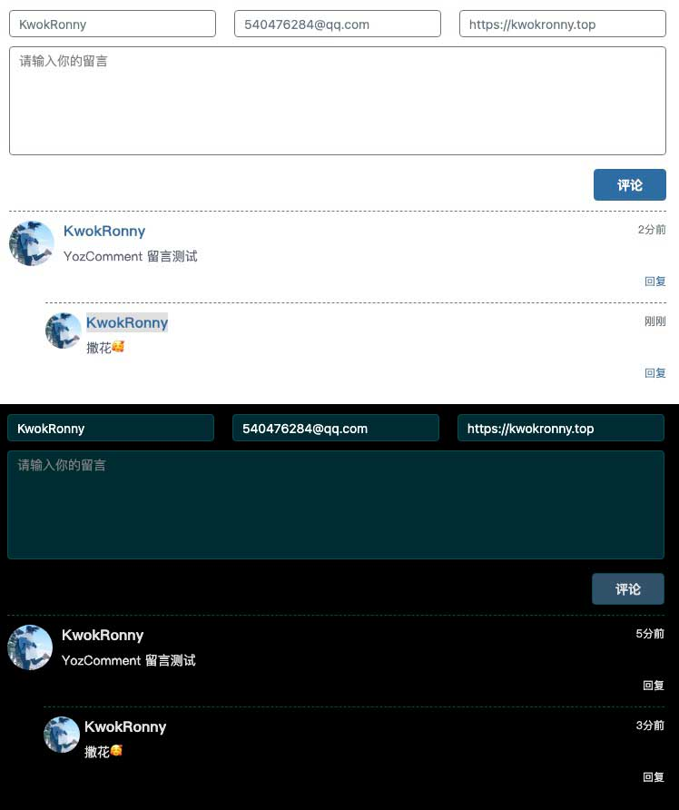
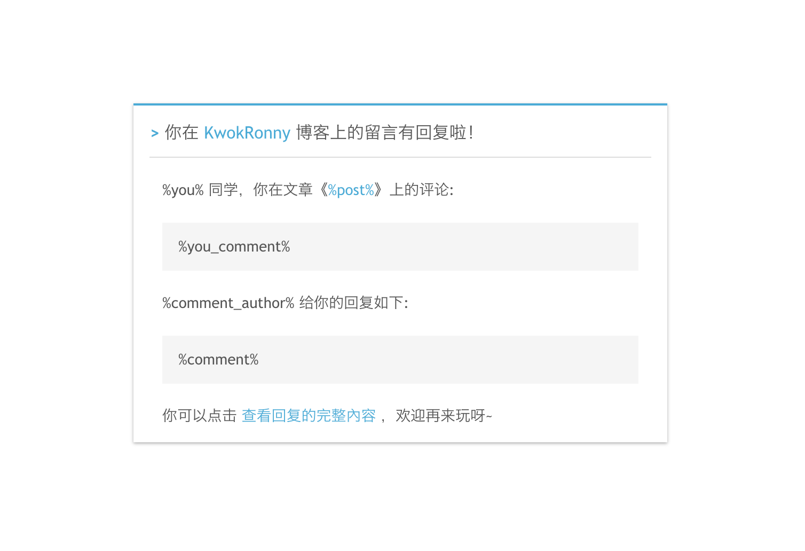
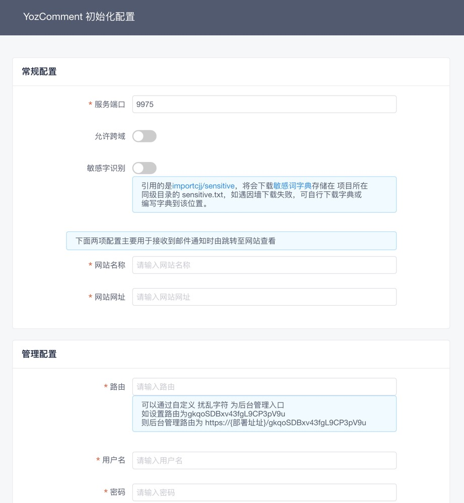
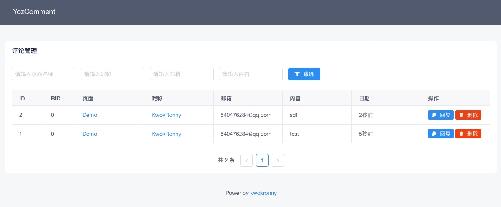

# YozComment

作者：[KwokRonny](https://kwokronny.top)


## 介绍
开源的 golang 评论系统。因自己博客与他人共用服务器，暂时知名的几个系统都是需要在服务器安装一定的依赖或环境，不想增加服务器负担，顺带学习 golang，便自己造了这个轮子。



- ### 特点
	* 多级评论
	* 部署简单，可视化配置
	* 支持MySQL、SQLite、PostgreSQL
	* 支持响应式
	* 支持 明/暗 主题
	* 接入 Gravatar 头像显示
	* 支持敏感词识别
	* 支持邮件通知自己 及 SendCloud平台 发信通知留言者有回复
	

## 安装

- ### 部署至服务器
	```bash
	nohup ./YozComment > /dev/null 2>&1 &
	```

- ### 【可选】SendCloud 发信通知

	为增加站点的互动，很多用户留言后通常无法得知自己的留言得到回复，也就减少了网站的互动性，但由于常见的邮箱存在被拦截SMTP发信问题，且SMTP协议直接发送会暴露服务器站点位置，所以就需要借助发信平台增强互动性啦，选用SendCloud原因是我好朋友与我共享了此平台的账号使用，后期需要增加其它平台可以提交pull-request（对开源项目管理经验少，如有需要还请不吝赐教）

	> 提供的邮件模板代码
	
	```html
	<p><span id="9999" style="display: none !important; font-size:0; line-height:0">你在 KwokRonny 博客上的留言有回复啦</span></p>

	<div style="background-color:white;border-top:2px solid #12ADDB;box-shadow:0 1px 3px #AAAAAA; line-height:180%; padding:0 15px 12px;width:500px;margin:100px auto;color:#555555;font-family:Century Gothic,Trebuchet MS,Hiragino Sans GB,微软雅黑,Microsoft Yahei,Tahoma,Helvetica,Arial,SimSun,sans-serif;font-size:14px;">
	<h2 style="border-bottom:1px solid #DDD;font-size:16px;font-weight:normal;padding:13px 0 10px 0;"><span style="color: #12ADDB;font-weight: bold;">&gt; </span>你在 <a href="https://kwokronny.top" style="text-decoration:none;color: #12ADDB;" target="_blank">KwokRonny</a> 博客上的留言有回复啦！</h2>

	<div style="padding:0 12px 0 12px;margin-top:18px">
	<p>%you% 同学，你在文章《<a href="%post_url%" style="text-decoration:none; color:#12addb" target="_blank">%post%</a>》上的评论:</p>

	<p style="background-color: #f5f5f5;border: 0 solid #DDD;padding: 10px 15px;margin:18px 0">%you_comment%</p>

	<p>%comment_author% 给你的回复如下:</p>

	<p style="background-color: #f5f5f5;border: 0 solid #DDD;padding: 10px 15px;margin:18px 0">%comment%</p>

	<p>你可以点击 <a href="%comment_url%" style="text-decoration:none; color:#12addb" target="_blank">查看回复的完整內容 </a>，欢迎再来玩呀~</p>
	</div>
	</div>
	```

	__预览__

	

- ### 配置安装

	运行后会检测到应用目录下 `./config.yaml` 是否存在，判断是否运行配置过程。

	访问 http://localhost:9975 会进入安装配置页面
	
	> SMTP邮件通知使用同域名的邮箱发送邮件通知避免邮件发送失败或进入垃圾桶

	

	根据配置页面操作完成后会在相应位置生成 `config.yaml` 配置文件后，手动重新启动应用

- ### 在页面中引用代码
	
	在展示评论组件的位置添加以下代码

	```html
	<script 
		id="YozComment" 
		src="{部署地址}/client.js" 
		token="页面唯一TOKEN" 
		theme="{light|dark}" 
		crossorigin="anonymous" 
		async></script>
	```

- ### 管理后台

	可以通过自定义 扰乱字符 为后台管理入口

	如设置路由为 `gkqoSDBxv43fgL9CP3pV9u`

	则后台管理路由为 https://{部署址址}/gkqoSDBxv43fgL9CP3pV9u/

	

## 开发

- ### 前端

	- 评论组件部分

		应用 Typescript 开发，开发架构及思路部分主要借鉴 [utterance](https://github.com/utterance/utterances) 。通过在网站内嵌 iframe 减少对代码间的冲突与安全问题。
		
		运行以下命令会将相关静态文件编译至 templates/web 文件夹下，并热更新应用

		```bash
		npm start
		```
	
	- 后台管理

		采用纯前端方式通过  CDN 引用 iviewui+axios完成配置页面，管理页面及登陆界面

- ### 后端

	后端运用 gin+gorm 开发，开发架构主要是MVC架构，并将所有静态资源 通过 [go-bindata-assetfs](https://github.com/elazarl/go-bindata-assetfs/) 打包进应用，方便部署。

	安装 [fresh](https://github.com/pilu/fresh) 开启热更新

	```bash 
	npm run bindata-install // 全局安装 go-bindata-assetfs 工具
	npm run bindata-debug
	# 在开发中，方便调试，通过 gin-bindata 提供的 debug 方法 对静态资源通过链接的方法调用
	go get github.com/pilu/fresh # 热更新全局工具安装
	fresh # 热更新调试开发
	```

- ### 构建 

	```bash
	npm run build
	npm run bindata
	go build main.go
	```